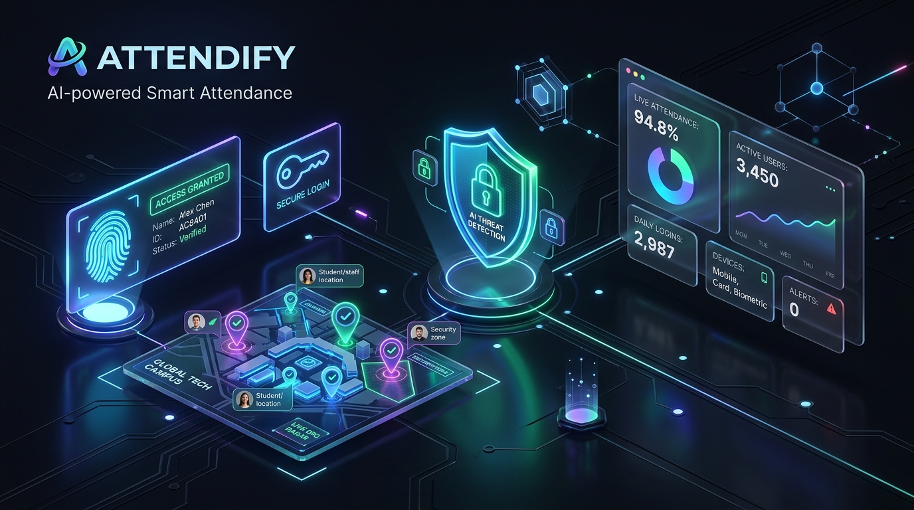
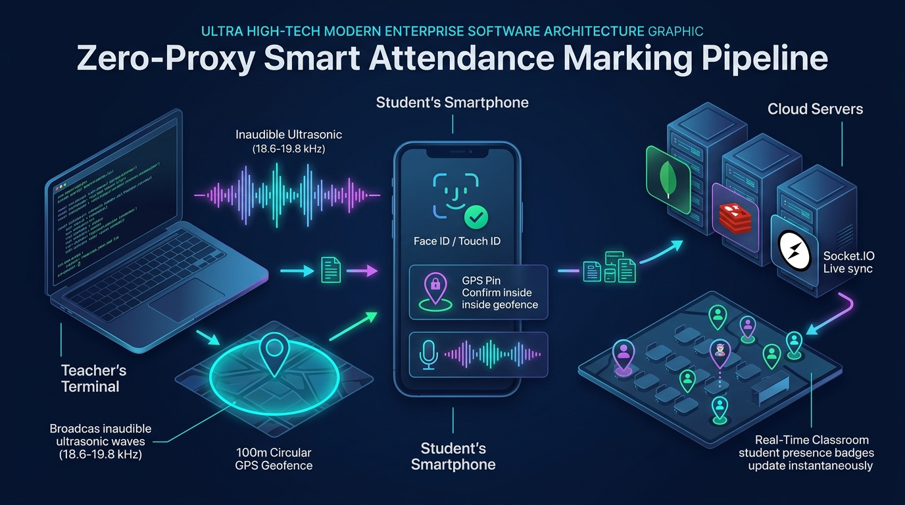
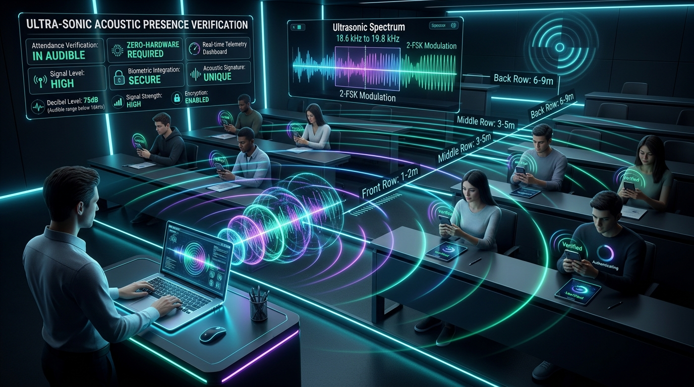

<div align="center">



<br/><br/>

# 🎓 ATTENDIFY

### Enterprise Zero-Proxy Biometric & Geofenced Smart Attendance Platform

[](https://nodejs.org)
[](https://expressjs.com)
[](https://mongodb.com)
[](https://redis.io)
[](https://socket.io)
[](https://webauthn.io)
[](#-ultrasonic-acoustic-presence-radar)
[](https://leafletjs.com)
[](#-automated-testing)
[](#-security--threat-mitigation-matrix)

<br/>

**Attendify** eliminates proxy attendance and buddy punching through **hardware-bound biometric passkeys (FIDO2/WebAuthn)**, **inaudible ultrasonic acoustic presence verification (18.6–19.8 kHz 2-FSK)**, **sub-meter GPS geofencing**, and **real-time WebSocket classroom telemetry** — engineered for scalable multi-tenant institutional deployment.

<br/>

[Overview](#-overview) · [GUI Security Architecture](#-complete-attendance-marking--multi-layer-security-architecture-gui-structure-format) · [Biometrics & Passkeys](#-fido2-biometric-passkeys) · [Acoustic Radar](#-ultrasonic-acoustic-presence-radar) · [Geospatial Engine](#-real-time-geospatial-radar) · [Architecture](#%EF%B8%8F-system-architecture) · [Tech Stack](#-technology-stack) · [Role Portals](#-role-portals) · [Deployment](#-production-deployment-on-render) · [Testing](#-automated-testing) · [Threat Matrix](#-security--threat-mitigation-matrix)

---

</div>

## ✨ Overview

Traditional college attendance methods like manual paper roll-calls, sign-in sheets, and static QR codes are vulnerable to proxy attendance, buddy punching, and GPS mock location spoofing. 

**Attendify** resolves this by establishing a zero-trust attendance pipeline that cryptographically validates **physical presence**, **indoor seating distance**, and **device-bound biometric identity** simultaneously:

```
┌─────────────────────────────────────────────────────────────────────────────┐
│                      ATTENDIFY TRIPLE-VERIFICATION PIPELINE                 │
├───────────────────────┬─────────────────────────────┬───────────────────────┤
│  1. HARDWARE PASSKEY  │  2. ULTRASONIC 2-FSK RADAR  │  3. GEOFENCE ENGINE   │
│  Apple Secure Enclave │  Inaudible 18.6–19.8 kHz    │  Haversine Geodesic   │
│  Android Hardware TEE │  2048-pt FFT Peak Binning   │  Sub-Meter GPS Radius │
│  Windows Hello TPM    │  Log-Distance Seating Range │  Anti-Spoof Velocity  │
└───────────────────────┴─────────────────────────────┴───────────────────────┘
```

---

## 🌟 Key Features

- **🔒 FIDO2 WebAuthn Hardware Passkeys** — Passwordless attendance authenticated via Touch ID, Face ID, Windows Hello, or Android Biometrics. Private keys never leave physical hardware security modules.
- **🔊 Inaudible Ultrasonic Acoustic Presence Radar** — Zero-hardware ultrasonic soundwaves (18.6 kHz – 19.8 kHz 2-FSK) verifying physical classroom presence and computing indoor seating row distance.
- **🛡️ Trusted Browser Attestation** — Secondary cryptographic device fingerprinting with canvas, WebGL GPU profiling, audio context hashing, and password step-up when biometrics are unavailable.
- **📍 Sub-Meter GPS Geofence Verification** — High-accuracy GPS verification computing geodesic distance to classroom centers using the Haversine formula on a WGS-84 Earth ellipsoid.
- **⚡ Live Tactical Classroom Radar** — Teachers monitor a real-time tactical radar map of connected students with live GPS pin tracking, marker clustering, and proximity badges powered by Socket.IO.
- **🏢 Enterprise Multi-Tenancy** — Complete data isolation across institutions, academic departments, class batches, timetable schedules, and faculty accounts.
- **📊 Automated Analytics & Excel Reports** — Instant multi-sheet `.xlsx` report exports, attendance heatmap calendars, and low-attendance alert triggers.
- **🔔 Web Push Notifications** — Background lecture alerts and passkey approval notices via Web Push (VAPID) and Service Workers.
- **📱 Fully Responsive Modern UI** — Cyber-glassmorphism dark aesthetic tailored for 4K desktops, laptops, tablets, and smartphones with zero horizontal overflow.

---

## 🛡️ Complete Attendance Marking & Multi-Layer Security Architecture (GUI Structure Format)

<div align="center">
  
</div>

<br/>

Attendify treats every attendance marking action as a **Zero-Trust Cryptographic Transaction** verified simultaneously across **5 distinct security layers**:

---

### 🗺️ Visual Multi-Layer Security Architecture & Dataflow

```
┌─────────────────────────────────────────────────────────────────────────────────────────────────────────────┐
│                                   ATTENDIFY ZERO-TRUST SECURITY DATAFLOW                                    │
├─────────────────────────────────────────────────────────────────────────────────────────────────────────────┤
│                                                                                                             │
│   👨‍🏫 FACULTY STATION (Laptop / Desktop)                                                                     │
│   ├─ 📡 Broadcasts 100m GPS Geofence Anchor (WGS-84 Coordinates: 28.5450° N, 77.1926° E)                    │
│   └─ 🔊 Emits Inaudible 18.6–19.8 kHz 2-FSK Acoustic Soundwave Burst                                         │
│                                                                                                             │
│                                           │                                                                 │
│                                           ▼  (Physical Classroom Air Gap)                                   │
│                                                                                                             │
│   📱 STUDENT SMARTPHONE (iOS / Android / Laptop)                                                            │
│   ├─ 📍 Layer 1: GPS Sub-Meter Geolocation Lock ────────▶ [Haversine Δ <= 100m : PASS ✓]                    │
│   ├─ 🔊 Layer 2: Ultrasonic Microphone DSP + FFT ───────▶ [18kHz High-Pass + Path Loss : PASS (2.1m) ✓]    │
│   ├─ 🔐 Layer 3: Hardware Secure Enclave Biometrics ────▶ [Touch ID / Face ID ES256 Signature : PASS ✓]     │
│   └─ 🛡️ Layer 4: Ephemeral HMAC-SHA256 Token ──────────▶ [One-Time Nonce (60s Lifetime) : SEALED ✓]        │
│                                                                                                             │
│                                           │                                                                 │
│                                           ▼  (TLS 1.3 Encrypted REST API)                                   │
│                                                                                                             │
│   ☁️ ATTENDIFY CLOUD ENGINE (Node.js + Redis + MongoDB Atlas)                                               │
│   ├─ 🔍 Verifies WebAuthn Signature against Stored Public Key                                               │
│   ├─ ⚡ Atomic ACID Database Commit (MongoDB Attendance Collection)                                          │
│   └─ 📡 Instant Socket.IO Broadcast (< 20ms) to Teacher Tactical Map                                         │
│                                                                                                             │
│                                           │                                                                 │
│                                           ▼                                                                 │
│                                                                                                             │
│   🎯 RESULT: [Harsh Koli (21CS042) Marked PRESENT · Front Row (2.1m) · Anti-Proxy Verified (100%)] ✓        │
│                                                                                                             │
└─────────────────────────────────────────────────────────────────────────────────────────────────────────────┘
```

---

### 🔢 Step-by-Step Interactive GUI Flow: Student & Faculty Experience

#### 🔹 Step 1: Session Discovery & Geofence Lock
- 📍 **Action**: Student opens the active lecture session from their device.
- 📡 **Security Check**: Browser requests high-accuracy GPS coordinates (`enableHighAccuracy: true`).
- 🧮 **Formula**: The backend computes great-circle distance $d$ via the Haversine formula on a WGS-84 ellipsoid:
  $$d = 2R \cdot \arcsin\left(\sqrt{\sin^2\left(\frac{\Delta\phi}{2}\right) + \cos(\phi_1)\cos(\phi_2)\sin^2\left(\frac{\Delta\lambda}{2}\right)}\right)$$
- 🟢 **GUI Feedback**: Green radar beacon confirms student is **INSIDE** the $100\text{m}$ geofence perimeter.

```
┌───────────────────────────────────────────────────────────────────────────────────────────────────┐
│ 📍 GEOFENCE LOCK STATUS                                                                           │
│ Coordinates: 28.5450° N, 77.1926° E · Accuracy: ±3.8m · Classroom Distance: 11.4m [LOCKED ✓]     │
└───────────────────────────────────────────────────────────────────────────────────────────────────┘
```

#### 🔹 Step 2: Inaudible Ultrasonic Acoustic Presence Capture
- 🔊 **Action**: Student microphone activates a Web Audio API listener with an active **18 kHz Biquad High-Pass Filter**.
- 📊 **Signal Processing**: Fast Fourier Transform ($N=2048$, $f_s=48\text{ kHz}$) extracts peak bin power at pilot carrier ($18.6\text{ kHz}$), Space ($19.2\text{ kHz}$), and Mark ($19.8\text{ kHz}$).
- 📏 **Indoor Path Loss Model**: Calculates distance $d = 10^{\frac{P_0 - P_r}{10n}}$ and assigns the seating row category:
  - 🥇 **Front Row (1–2)**: Distance $\le 2.5\text{m}$ (Signal Power $\ge 200/255$)
  - 🥈 **Middle Row (3–5)**: Distance $3.6\text{m} - 5.8\text{m}$ (Signal Power $140 - 199/255$)
  - 🥉 **Back Row (6–9)**: Distance $8.1\text{m} - 12.0\text{m}$ (Signal Power $90 - 139/255$)

```
┌───────────────────────────────────────────────────────────────────────────────────────────────────┐
│ 🔊 ULTRASONIC ACOUSTIC SPECTRUM DETECTED                                                          │
│ Frequencies: 18.6kHz Pilot (✓) · 19.2kHz Space (✓) · 19.8kHz Mark (✓)                             │
│ Received Power: 184/255 · Distance: 2.1 meters · Row Category: [FRONT ROW (1–2) ✓]                │
└───────────────────────────────────────────────────────────────────────────────────────────────────┘
```

#### 🔹 Step 3: Hardware Enclave Biometric Assertion (FIDO2 / WebAuthn)
- 🔒 **Action**: Device prompts native biometric dialog (Touch ID, Face ID, Windows Hello, or Android Fingerprint).
- 🛡️ **Hardware Security**: The private key stored inside the device's **Apple Secure Enclave** or **Android Hardware TEE** signs the server's 32-byte challenge using `ES256` asymmetric ECDSA.
- 🚫 **Proxy Defense**: Physical human presence is mandatory. Credentials cannot be shared, cloned, or screenshotted.

```
┌───────────────────────────────────────────────────────────────────────────────────────────────────┐
│ 🔒 FIDO2 WEBAUTHN HARDWARE PROMPT                                                                 │
│ Authenticator: Apple Secure Enclave (Touch ID / Face ID) · Algorithm: ECDSA P-256 (ES256)        │
│ Assertion Signature: Verified against Public Key `pubkey_89a01bf...` [MATCH 100% ✓]               │
└───────────────────────────────────────────────────────────────────────────────────────────────────┘
```

#### 🔹 Step 4: Ephemeral Token Validation & Atomic DB Commit
- ⚡ **Action**: Payload (`biometricAssertion` + `acousticProof` + `gpsTelemetry` + `csrfToken`) is transmitted to `/api/student/mark-attendance`.
- 🔐 **Anti-Replay**: The backend checks single-use nonce freshness ($< 60\text{s}$ lifetime) and acquires a distributed Redis lock.
- 💾 **Persistence**: Attendance is committed atomically to MongoDB with full metadata:
  ```json
  {
    "studentId": "65b019f...",
    "lectureId": "65b021c...",
    "status": "present",
    "verifiedVia": "FIDO2_PASSKEY_ACOUSTIC_RADAR",
    "seatingDistanceMeters": 2.1,
    "rowCategory": "Front Row",
    "confidenceScore": 98,
    "timestamp": "2026-09-01T14:02:18.412Z"
  }
  ```

#### 🔹 Step 5: Real-Time Faculty Tactical Radar Synchronization
- 📡 **Action**: Backend emits a `student:attendance-marked` event over Socket.IO.
- 👨‍🏫 **Teacher Terminal**: The teacher's live tactical map updates in $< 20\text{ms}$ with the student's avatar pin, distance badge, and live class count increment (`44 / 50 Present · 88%`).

```
┌───────────────────────────────────────────────────────────────────────────────────────────────────┐
│ 🔴 TEACHER LIVE TACTICAL RADAR HUD                                                                │
│ [CS401 Lab 101] · Active Students: 44/50 (88%) · Latency: 18ms · WebSocket: CONNECTED ●         │
│ Pin: Harsh Koli (HK) · Seating: Front Row (2.1m) · Auth: FIDO2 ES256 · Status: [VERIFIED ✓]       │
└───────────────────────────────────────────────────────────────────────────────────────────────────┘
```

---

## 🔐 FIDO2 Biometric Passkeys

<div align="center">
  
</div>

Attendify implements a **Dual-Layer Identity Assurance Architecture**: Primary biometric passkey verification backed by cryptographic trusted browser attestation.

### 1. FIDO2 / WebAuthn Biometric Passkeys (Primary)

Passkeys eliminate shared passwords and credential theft. When a student registers a passkey on their device (smartphone, laptop, or tablet):

1. **Hardware Keypair Generation**: The device's **Apple Secure Enclave**, **Android TEE (Trusted Execution Environment)**, or **Windows TPM** generates an asymmetric cryptographic keypair (`ES256` / `P-256` / `Ed25519`).
2. **Public Key Registration**: The public key is transmitted to Attendify and permanently stored in MongoDB under the student's profile. The **private key never leaves the physical hardware security chip**.
3. **Challenge-Response Signature**: When marking attendance:
   - The server issues a cryptographically secure 32-byte one-time challenge.
   - The student verifies their physical presence via fingerprint or facial scan.
   - The device's Secure Enclave signs the challenge with the private key.
   - The server verifies the signature, origin, Relying Party ID (`RP_ID`), and anti-replay counters.

```
Student Device (Secure Enclave)                    Attendify Server (Node.js)
        │                                                     │
        │ ── 1. GET /attendance/passkey/options ────────────> │  (Generate 32-byte challenge)
        │ <── 2. Challenge + RP ID + Allowed Credentials ──── │
        │                                                     │
        │  [Biometric Scan Verified (Face ID / Fingerprint)]  │
        │  [Hardware Signs Server Challenge]                  │
        │                                                     │
        │ ── 3. POST /attendance/passkey/verify ────────────> │  (Verify signature against stored public key)
        │ <── 4. Signed Attendance Token Issued ✓ ─────────── │
```

### 2. Trusted Browser Attestation (Zero-Proxy Fallback)

When biometric sensors are temporarily unavailable, students authenticate through **Trusted Browsers**:

1. **Entropy-Based Device Fingerprinting**: The client generates a multi-dimensional browser entropy hash combining canvas rendering signatures, WebGL GPU profile, audio context fingerprint, and hardware concurrency parameters.
2. **Salted Token Exchange**: When a student registers their trusted browser, they provide their student password. The server validates credentials and registers a device ID with an activation delay.
3. **Single-Device Token Binding**: Each attendance request generates an ephemeral HMAC token validated against the student's active device signature, preventing browser profile cloning and proxy submissions.

---

## 🔊 Ultrasonic Acoustic Presence Radar

<div align="center">
  
</div>

When GPS signals are degraded by concrete multipath interference indoors, Attendify utilizes **inaudible ultrasonic acoustics (18.6 kHz – 19.8 kHz)** using standard laptop speakers and smartphone microphones — **zero external hardware required**.

### 1. Inaudible 2-FSK Modulation Scheme

The faculty station broadcasts continuous, inaudible 2-Frequency Shift Keying (2-FSK) modulated frames during active attendance windows:

- **Pilot Carrier Sync Tone**: $f_{\text{pilot}} = 18{,}600\text{ Hz}$ ($2 \times$ symbol duration)
- **Binary '0' (Space)**: $f_{\text{space}} = 19{,}200\text{ Hz}$
- **Binary '1' (Mark)**: $f_{\text{mark}} = 19{,}800\text{ Hz}$
- **Symbol Duration**: $T_s = 25\text{ ms}$ per bit (4-bit preamble + 24-bit session payload)

### 2. High-Pass Noise Elimination & FFT Binning

Students' devices capture audio via Web Audio API with an active **18,000 Hz Biquad High-Pass Filter**, completely eliminating human speech, air conditioning hum, and ambient classroom noise. The discrete FFT frequency bin index is computed as:

$$k = \left\lfloor \frac{f \cdot N_{\text{FFT}}}{f_s} \right\rceil$$

Where $N_{\text{FFT}} = 2048$ and $f_s$ is the browser audio context sample rate ($44.1\text{ kHz}$ or $48\text{ kHz}$).

### 3. Log-Distance Indoor Seating Ranging

Received ultrasonic signal power $P_r$ (quantized $0 - 255$) correlates directly with physical seating distance from the instructor's laptop via the acoustic log-distance path loss model:

$$P_r(d) = P_0 - 10n \log_{10}\left(\frac{d}{d_0}\right)$$

| Received Signal Power ($P_r$) | Seating Distance Range | Classroom Zone Category | Confidence Score |
| :--- | :--- | :--- | :--- |
| **$P_r \ge 200$** | $1.0\text{ m} - 2.5\text{ m}$ | **Front Row (1–2)** | $90\% - 100\%$ |
| **$140 \le P_r < 200$** | $3.6\text{ m} - 5.8\text{ m}$ | **Middle Row (3–5)** | $75\% - 89\%$ |
| **$90 \le P_r < 140$** | $8.1\text{ m} - 12.0\text{ m}$ | **Back Row (6–9)** | $60\% - 74\%$ |
| **$75 \le P_r < 90$** | $15.1\text{ m} - 18.0\text{ m}$ | **Far Seating (10+)** | $50\% - 59\%$ |
| **$P_r < 75$** | Undetected / Outside | Outside Acoustic Range | $0\%$ |

```
Faculty Laptop (Acoustic Emitter)                   Student Device (Acoustic Listener)
        │                                                           │
        │ ── Inaudible 18.6kHz Pilot Sync Burst (50ms) ───────────> │ (High-Pass Filter > 18kHz)
        │ ── 2-FSK Encoded Session Token (19.2k/19.8kHz) ─────────> │ (FFT Peak Extraction)
        │                                                           │ (Path Loss Distance Calculation)
        │                                                           │
        │                                                           │ ── POST /attendance/mark
        │                                                           │    { acousticProof: { verified: true,
        │                                                           │      distanceMeters: 1.8, rowCategory: "Front Row" } }
```

---

## 📡 Real-Time Geospatial Radar

<div align="center">
  
</div>

During active lecture sessions, faculty monitor attendance through a live geospatial radar:

- 🟢 **Inside Geofence** — Student GPS telemetry is verified within the active classroom boundary radius.
- 🟡 **Near Boundary** — Student position is within margin of GPS accuracy drift ($\pm 15\text{m}$).
- 🔴 **Outside Boundary** — Student coordinates exceed the allowed geofence perimeter.
- 📡 **Live Telemetry Beacon** — Real-time GPS stream over WebSockets with 0 page refreshes.

### Haversine Geofence Formula

Classroom boundary verification calculates great-circle geodesic distances between student GPS coordinates and the classroom anchor point:

$$d = 2R \cdot \arcsin\left(\sqrt{\sin^2\left(\frac{\Delta\phi}{2}\right) + \cos(\phi_1)\cos(\phi_2)\sin^2\left(\frac{\Delta\lambda}{2}\right)}\right)$$

Where $R = 6{,}371{,}000\text{ m}$ (mean Earth radius), $\phi$ is latitude, and $\lambda$ is longitude in radians.

---

## 🏛️ System Architecture

<div align="center">
  
</div>

Attendify is structured across a decoupled **5-tier production architecture**:

```
┌─────────────────────────────────────────────────────────────────────────────┐
│                                CLIENT TIER                                  │
│   Responsive EJS · PWA · Service Workers · Web Audio FFT · FIDO2 Client     │
├─────────────────────────────────────────────────────────────────────────────┤
│                              GATEWAY TIER                                   │
│   Cloudflare / Reverse Proxy · SSL/TLS 1.3 · WebSocket Protocol Upgrade     │
├─────────────────────────────────────────────────────────────────────────────┤
│                            APPLICATION TIER                                 │
│   Node.js Cluster · Express 5 · Socket.IO Server · Passport.js Authentication│
│   Double-Submit CSRF · Sliding Rate Limiter · WebPush Dispatcher            │
├─────────────────────────────────────────────────────────────────────────────┤
│                          COORDINATION LAYER                                 │
│   Redis 7: GPS Telemetry Store · Distributed Mutex Locks · Session Cache    │
├─────────────────────────────────────────────────────────────────────────────┤
│                           PERSISTENCE TIER                                  │
│   MongoDB Atlas · Mongoose ODM · Compound 2dsphere Indexes · Encrypted Store│
└─────────────────────────────────────────────────────────────────────────────┘
```

---

## 💻 Technology Stack

<div align="center">

| Layer | Technologies | Role & Implementation |
| :--- | :--- | :--- |
| **Backend Core** | Node.js v18+, Express 5 | Async middleware pipeline, REST API endpoints |
| **Database** | MongoDB Atlas, Mongoose ODM | Document storage, compound indexes, soft deletes |
| **Realtime Engine** | Socket.IO 4+ | Low-latency bi-directional WebSocket streaming |
| **In-Memory Cache** | Redis 7+, ioredis | Distributed locks, GPS hash store, query caching |
| **Biometric Auth** | `@simplewebauthn/server`, FIDO2 | Passkey creation, assertion signature verification |
| **Acoustic Radar** | Web Audio API, 2-FSK, FFT | Inaudible ultrasonic presence & indoor seating ranging |
| **GIS & Mapping** | Leaflet.js, MarkerCluster | Interactive tactical map, radar circles, clustering |
| **Templating** | EJS, Modern CSS Tokens | Server-rendered UI with glassmorphism design tokens |
| **Reporting** | ExcelJS | Multi-sheet `.xlsx` attendance exports with formulas |
| **Push Alerts** | `web-push`, Service Workers | VAPID push notifications for class reminders |
| **Security** | Helmet, bcrypt, CSRF guards | CSP headers, timing-safe tokens, sliding rate limits |

</div>

---

## 👥 Role Portals

<div align="center">
  
</div>

<div align="center">

| Capability | 👑 Super Admin | 🏛️ College Admin | 👨‍🏫 Teacher / Faculty | 👨‍🎓 Student |
| :--- | :---: | :---: | :---: | :---: |
| **Institution Onboarding & Licensing** | ✅ | ❌ | ❌ | ❌ |
| **System Telemetry & Health Audit** | ✅ | ❌ | ❌ | ❌ |
| **Departments, Batches & Timetables** | ❌ | ✅ | ❌ | ❌ |
| **Classroom GPS Geofence Anchors** | ❌ | ✅ | ❌ | ❌ |
| **Student Roster & CSV Import** | ❌ | ✅ | ❌ | ❌ |
| **Launch Geofenced Lecture Session** | ❌ | ❌ | ✅ | ❌ |
| **Live Tactical Radar & Overrides** | ❌ | ❌ | ✅ | ❌ |
| **Export Excel (.xlsx) Reports** | ❌ | ✅ | ✅ | ❌ |
| **Mark Attendance (Passkey + GPS)** | ❌ | ❌ | ❌ | ✅ |
| **Trusted Browser Fallback Setup** | ❌ | ❌ | ❌ | ✅ |
| **Attendance Heatmap & Percentages** | ❌ | ❌ | ❌ | ✅ |

</div>

---

## 🚀 Quick Start (Local Development)

### 1. Clone Repository & Install Dependencies

```bash
git clone https://github.com/harshkolicool/Attendify.git
cd Attendify
npm install
```

### 2. Configure Environment Variables

Create a `.env` file in the root directory:

```env
PORT=5500
NODE_ENV=development
APP_ORIGIN=http://localhost:5500
APP_URL=http://localhost:5500

# MongoDB Connection
MONGO_URI=mongodb+srv://<username>:<password>@cluster0.mongodb.net/attendify?retryWrites=true&w=majority

# Session & Cryptographic Secrets
SESSION_SECRET=your_super_secret_session_key_min_32_chars
ATTENDANCE_TOKEN_SECRET=your_attendance_token_secret_32_chars

# WebAuthn Configuration
RP_ID=localhost
RP_NAME=Attendify Local

# Redis Cache (Optional for local dev, auto-falls back to in-memory)
REDIS_URL=redis://127.0.0.1:6379

# Web Push Notification Keys (Optional)
VAPID_PUBLIC_KEY=your_vapid_public_key
VAPID_PRIVATE_KEY=your_vapid_private_key
VAPID_SUBJECT=mailto:admin@attendify.local
```

### 3. Initialize Platform Super Admin & Start Server

```bash
# Seed initial Super Admin account
npm run init:admin

# Start development server with live reload
npm run dev
```

Visit `http://localhost:5500` in your browser.

---

## ☁️ Production Deployment on Render

Deploying Attendify to [Render](https://render.com) takes less than 5 minutes:

### 1. Connect Repository
1. Log in to [Render Dashboard](https://dashboard.render.com/).
2. Click **New +** $\rightarrow$ **Web Service**.
3. Select your GitHub repository (`Attendify`).

### 2. Configure Service Settings

| Setting | Value |
| :--- | :--- |
| **Runtime** | `Node` |
| **Build Command** | `npm install` |
| **Start Command** | `npm start` |
| **Instance Type** | `Starter` (Recommended for persistent WebSockets) |

### 3. Production Environment Variables

Add the following environment variables in the Render dashboard:

```env
NODE_ENV=production
PORT=10000
MONGO_URI=mongodb+srv://<username>:<password>@cluster0.mongodb.net/attendify?retryWrites=true&w=majority
SESSION_SECRET=<generate-a-strong-random-32-char-secret>
ATTENDANCE_TOKEN_SECRET=<generate-a-strong-random-32-char-secret>

# WebAuthn Domain Configuration (Must match your Render or custom domain)
APP_URL=https://attendify.onrender.com
RP_ID=attendify.onrender.com
ORIGIN=https://attendify.onrender.com

# Web Push Notification Keys (Generate via: npx web-push generate-vapid-keys)
VAPID_PUBLIC_KEY=<your-vapid-public-key>
VAPID_PRIVATE_KEY=<your-vapid-private-key>
VAPID_SUBJECT=mailto:admin@attendify.com
```

### 4. Deploy & Seed Super Admin
1. Click **Create Web Service**. Render will automatically build and start the application.
2. In the Render Shell tab, run the seed script to create your super admin account:
   ```bash
   npm run init:admin
   ```
3. Log in at `https://your-app-name.onrender.com/platform-admin/login`.

---

## 🧪 Automated Testing

Attendify includes a comprehensive multi-tier automated test suite covering syntax checks, token signing, geofencing algorithms, and acoustic calculations:

```bash
# Run complete test suite (syntax linting + flow unit tests)
npm test

# Run flow unit tests directly
npm run test:flows

# Run syntax quality check across all 90+ files
npm run lint
```

### Test Suite Coverage

```
✔ Acoustic frequency bin calculations map correctly above human hearing
✔ Acoustic log-distance path loss correctly classifies seating rows
✔ Attendance token validates for correct session and student
✔ Tampered attendance token is rejected
✔ Expired attendance token is rejected
✔ Adaptive confidence threshold increases for small radius and weak network
✔ Strongly inside position passes even with low confidence
✔ Boundary-ambiguous low-confidence fix requests retry
✔ Clearly outside position fails
✔ isValidCoordinate rejects (0, 0) and out-of-range coordinates
✔ inferAccuracyFromMeta conservatively inflates accuracy when samples are poor
✔ IP prefix normalization works for IPv4 and IPv6
✔ Trusted-device risk remains low for expected context
✔ Trusted-device risk escalates and requires step-up when profile changes
✔ Token rotation policy triggers after configured window
----------------------------------------------------------------------
ℹ Tests: 15 passed, 0 failed, 0 skipped
```

---

## 🛡️ Security & Threat Mitigation Matrix

<div align="center">

| Attack Vector | Traditional System Risk | Attendify Cryptographic Defense |
| :--- | :--- | :--- |
| **Proxy Passkey Sharing** | 🔴 High (Shared credentials/passwords) | 🟢 **Zero**. Private keys are locked in device Hardware HSM (Apple Secure Enclave / Android TEE) and cannot be exported. |
| **GPS Mock Location Spoofing** | 🔴 High (Fake GPS apps mock coordinates) | 🟢 **Blocked**. Triple verification requires concurrent inaudible **18.6–19.8 kHz Ultrasonic Acoustic** proof from physical classroom. |
| **Token Replay Attacks** | 🔴 High (Static QR / repeated tokens) | 🟢 **Blocked**. Single-use 32-byte cryptographic challenges, timestamped HMAC attendance tokens, and anti-replay counters. |
| **Man-in-the-Middle (MITM)** | 🟡 Medium (Unencrypted / intercepted data) | 🟢 **Blocked**. Strict TLS 1.3 encryption, RP ID origin binding, and timing-safe double-submit CSRF protection. |
| **Brute-Force Login Attacks** | 🔴 High (Credential stuffing) | 🟢 **Blocked**. Distributed Redis sliding rate limiting per IP and per account. |
| **Tampered Audit Trails** | 🔴 High (Manual override falsification) | 🟢 **Protected**. Immutable session logs with faculty timestamp, GPS coordinates, and verification type. |

</div>

---

## 📄 License

<div align="center">

**© 2026 Attendify. All Rights Reserved.**

This software is proprietary. Unauthorized copying, distribution, or commercial deployment without written permission is strictly prohibited.

Built with ❤️ by [Harsh Koli](https://github.com/harshkolicool)

</div>
